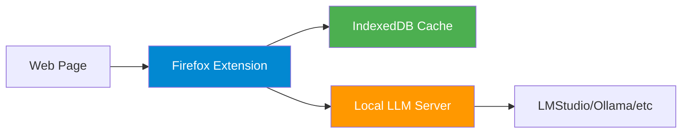

# Context Translator


This is a browser (currently: Firefox) extension for context-aware translation using local LLM server. Activate it, choose a lanugage pair, and click on words or phrases to trasnlate them directly on web pages with context-aware understanding. Great for learning new languages!

## Overview

Context Translator sends selected words to your local LLM server for translation. It also sends the surrounding text, helping it understand ambiguous words in context. All processing happens locally on your machine for complete privacy.

## Why?

Firefox and other browsers already offer translation features, so why this extension? Its main purpose is to help you learn new languages by allowing you to choose which words to translate. However, words in isolation often have multiple meanings, and the optimal one depends on the context. This extension helps you understand the intended meaning by providing context-aware translations.

Also, unlike paid offerings, this is free and open source. If you have ideas how to improve it, please open an issue or submit a pull request.

**Key Features:**
- Context-aware translation using surrounding text
- Direct communication with local LLM servers (LMStudio, Ollama, etc.)
- Inline and tooltip display modes
- Smart caching for instant repeated lookups
- Customizable styling and languages
- 100% local and private

## Architecture



The extension runs entirely in your browser, communicating only with your local LLM server. No external services, no data collection.

## Installation

### Quick Install

1. Download the latest `.xpi` from [Releases](../../releases)
2. Open Firefox and navigate to `about:addons`
3. Click the gear icon → "Install Add-on From File"
4. Select the downloaded `.xpi` file

### From Source

```bash
# Clone repository
git clone <repository-url>
cd context-translator

# Install dependencies and run tests
npm install
npm test

# Package extension
./scripts/package-extension.sh

# Install dist/context-translator.xpi in Firefox
```

## Usage

### Setup

1. **Start your LLM server** (LMStudio, Ollama, etc.) on `localhost:1234`, select and load a model (e.g. Gemma)
2. **Click the extension icon** and open Settings (cogwheel emoji)
3. **Configure languages** - Select source/target languages - you can add custom languages, if your model can handle them
4. **Configure LLM endpoint** - Set host and port if not using defaults

### Translating

1. **Toggle translator** - Click extension icon or press `Ctrl+Alt+C`
2. **Click any word** on the page to translate it
3. **View translation** - Appears inline or in tooltip (configurable)

### Keyboard Shortcuts

- `Ctrl+Alt+C` - Toggle translator on/off

## Settings

### Languages

- **Manage Languages** - Add custom languages beyond the defaults
- **Source Language** - Language of the text you're reading
- **Target Language** - Language to translate into

### Display

- **Mode** - Inline (above word) or Tooltip (floating box)
- **Dark Mode** - Follows system preference or manual override
- **Log to Console** - Enable debug logging for troubleshooting

### Translation Styling

- **Font Color** - Color of translated text
- **Background** - Background color for translations
- **Opacity** - Background transparency (0-100%)

### LLM Server

- **Host** - LLM server hostname (default: `localhost`)
- **Port** - LLM server port (default: `1234`)

### Rate Limiting

- **Enable Rate Limit** - Throttle translation requests
- **Requests per Minute** - Maximum requests (1-120)

### Cache

- **Use Cache** - Enable instant lookups for repeated translations
- **Clear Cache** - Remove all cached translations

### Context

- **Use Context** - Send surrounding text to improve accuracy
- **Window** - Characters of context around word (0-1000)

## Development

### Project Structure

```
extension/
├── manifest.json           # Extension manifest (MV3)
├── background/            # Service worker and background tasks
│   ├── service-worker.js  # Main background script
│   ├── message-handler.js # Message routing
│   ├── llm-client.js      # LLM API client
│   ├── cache-manager.js   # IndexedDB cache
│   └── ...
├── content/               # Content scripts
│   ├── main.js           # Main translation logic
│   ├── handlers/         # Click and text extraction
│   ├── ui/               # UI components
│   └── styles/           # CSS files
├── shared/               # Shared utilities
│   ├── settings-manager.js
│   ├── language-manager.js
│   └── ...
├── popup/                # Extension popup
│   ├── popup.html
│   └── popup.js
└── tests/                # Jest test suite
```

### Testing

```bash
# Run all tests
npm test

# Run specific test file
npm test -- llm-client

# Run with coverage
npm test -- --coverage
```

### Packaging

```bash
# Create distributable .xpi
./scripts/package-extension.sh

# Output: dist/context-translator.xpi
```

## Tested LLM Servers

Works with any OpenAI-compatible API:

- **LMStudio** - Recommended, easiest setup
- **Ollama** - `OLLAMA_ORIGINS=* ollama serve`
- **llama.cpp** - With `--api-key` flag
- **text-generation-webui** - OpenAI extension enabled
- **vLLM** - OpenAI-compatible mode

### Recommended Models

- Gemma 3 12B/27B
- Qwen 3 8B

Larger models provide better translation quality, especially for context awareness.

## Privacy & Security

- **100% Local** - All processing on your machine
- **No Telemetry** - Zero analytics or tracking
- **Localhost Only** - Extension only connects to `localhost` or `127.0.0.1`
- **Cache Privacy** - Translations stored locally in IndexedDB
- **Open Source** - Full transparency, audit the code yourself

## Troubleshooting

### Translations fail
- Verify LLM server is running: `curl http://localhost:1234/v1/models`
- Check browser console (F12) for error messages
- Ensure server host/port match settings

### Cache issues
- Clear cache via Settings → Cache → Clear Cache
- Disable cache temporarily to test if cache is causing issues

## License

MIT License

## Contributing

Contributions welcome! Please:

1. Fork the repository
2. Create a feature branch
3. Write tests for new features
4. Ensure all tests pass (`npm test`)
5. Submit a pull request

## Support

- **Issues** - [GitHub Issues](../../issues)
- **Discussions** - [GitHub Discussions](../../discussions)
- **Releases** - [GitHub Releases](../../releases)
